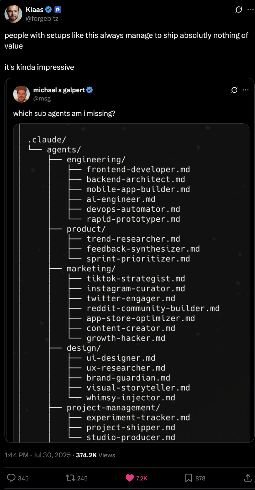

# Week 5: Context Engineering
## Sub-agents and RAG

---

# Session Goals

- Understand sub-agent architecture and use cases
- Use the Task tool to spawn specialized agents
- Build multi-agent workflows for GTM pipelines
- Connect to vector databases with Vectorize.io

---

# The Problem with Single Agents

Complex workflows strain a single agent:
- Context window fills up
- Focus dilutes across tasks
- Errors cascade

---

# The Real Killer: Context Flooding

Research 10 companies without sub-agents:
- Every search result floods context
- By company #5, agent forgot company #1

---

# What Are Sub-agents?

A separate agent instance that handles a focused subtask.

Like a boss delegating to employees.

---

# Key Insight

**Sub-agents are black boxes for context management.**

All intermediate steps stay in the sub-agent's context. Only the final result returns.

---

# Without Sub-agents

```
Main Agent Context:
- Task: Research 10 companies
- WebSearch result Company 1 (500 tokens)
- WebFetch page content (2000 tokens)
- WebSearch result Company 2 (500 tokens)
- ... context explodes ...
```

---

# With Sub-agents

```
Main Agent Context:
- Task: Research 10 companies
- Company 1 result: "Acme Corp, 500 employees..."
- Company 2 result: "TechCo, 200 employees..."
- ... clean, manageable context ...
```

---

# Sub-agent Characteristics

- Isolated context: each starts fresh
- Own conversation: doesn't pollute main agent
- Specialized tools: can restrict per sub-agent
- Single level: cannot spawn their own sub-agents

---

# Multi-Agent Architecture

```
┌─────────────────────────────────────────────────────────┐
│                    Main Agent                           │
└─────────────────────────────────────────────────────────┘
          │              │              │
          ▼              ▼              ▼
┌─────────────┐  ┌─────────────┐  ┌─────────────┐
│  Enrichment │  │   Scorer    │  │   Writer    │
│    Agent    │  │    Agent    │  │    Agent    │
└─────────────┘  └─────────────┘  └─────────────┘
```

---

# Benefits of Sub-agents

- Focused context per task
- Parallel execution possible
- Specialized tools per agent
- Isolated failures

---

# The Task Tool

```
> Use the code-reviewer agent to review this PR
```

Creates isolated context for sub-agent.

---

# Task Tool Parameters

| Parameter | Required | Description |
|-----------|----------|-------------|
| prompt | Yes | Task for sub-agent |
| description | Yes | Short summary (3-5 words) |
| subagent_type | Yes | Which agent type |

---

# Optional Parameters

| Parameter | Description |
|-----------|-------------|
| model | Override model (sonnet, opus, haiku) |
| max_turns | Limit API round-trips |
| run_in_background | Run asynchronously |

---

# Built-in Sub-agent Types

| Agent Type | Model | Use Case |
|------------|-------|----------|
| Explore | Haiku | Codebase exploration |
| Plan | Inherited | Architecture planning |
| Bash | Inherited | Command execution |
| general-purpose | Inherited | Flexible tasks |

---

# When to Use Each

- **Explore:** Fast research, finding files
- **Plan:** Design before implementing
- **Bash:** Git operations, running scripts
- **General-purpose:** Complex multi-step work

---

# Creating Custom Agents

Create `.claude/agents/company-researcher.md`:

```markdown
---
name: company-researcher
description: Research a company for sales prep.
model: haiku
tools: ["Read", "WebSearch", "WebFetch"]
---
```

---

# Don't Over-Engineer



*"Whimsy-injector.md" is not a real agent you need.*

---

# Workflow Patterns

**Sequential Pipeline:**
```
Lead → [Enrichment] → [Scoring] → [Email Draft] → Output
```

---

# Parallel Processing

```
        ┌─→ [Agent 1] ─→┐
Lead ───┼─→ [Agent 2] ─→┼─→ Combine
        └─→ [Agent 3] ─→┘
```

---

# Good Decomposition

- Each agent has clear, focused purpose
- Minimal overlap between agents
- Well-defined inputs and outputs

---

# Anti-patterns

- Too many tiny agents (overhead)
- Agents that do "everything"
- Circular dependencies

---

# Error Handling

When sub-agents fail:
```
> If enrichment fails for a company,
> note it as "Research Failed" and continue
```

---

# Lab 1: Using Built-in Sub-agents

```
> How does the authentication system work in this codebase?
```

Watch Claude spawn an Explore agent using Haiku.

---

# Lab 1: Parallel Exploration

```
> I need to understand three things in parallel:
> 1. How data validation works
> 2. How errors are handled
> 3. How logging is configured
```

---

# Lab 1: Create Custom Agent

Create `.claude/agents/company-researcher.md`

Then test:
```
> Use company-researcher to research Stripe
```

---

# Lab 2: Build a GTM Pipeline

Create a lead processing pipeline:
1. Takes a list of leads
2. Enriches each with company research
3. Scores based on your rubric
4. Drafts personalized outreach

---

# Create Lead Enricher Agent

```markdown
---
name: lead-enricher
description: Enrich a lead with company research.
model: haiku
tools: ["Read", "WebSearch", "WebFetch"]
---
```

---

# Create Email Drafter Agent

```markdown
---
name: email-drafter
description: Draft personalized outreach emails.
model: sonnet
tools: ["Read", "Write"]
---
```

---

# Test the Pipeline

```
> Run the lead pipeline on the top 5 leads
> from startup-funding.db
```

---

# Context, Memory, and RAG

For large knowledge bases, use retrieval-augmented generation.

| Traditional RAG | Agentic Search |
|-----------------|----------------|
| Fixed retrieval | Agent decides when to retrieve |
| Same query for all | Agent reformulates queries |
| Top-K stuffed in prompt | Agent filters and synthesizes |

---

# When to Use Vector Search vs Filesystem

| Use Case | Best Approach |
|----------|---------------|
| Structured data (CSV, DB) | SQL/grep - precise matching |
| Unstructured docs (PDFs) | Vector search - semantic |
| Finding similar past deals | Vector search - similarity |

---

# Vectorize.io for RAG

Visual workflow builder with Claude Code MCP integration:
- Upload docs in the UI (PDFs, Word, Markdown)
- Automatic vectorization
- MCP agent connects directly to Claude Code

---

# Connect Vectorize to Claude Code

```bash
claude mcp add vectorize-mcp \
  --env VECTORIZE_API_KEY=YOUR_KEY \
  -- npx -y mcp-remote@latest \
  https://agents.vectorize.io/api/agents/ID/mcp \
  --header "Authorization: Bearer ${VECTORIZE_API_KEY}"
```

---

# RAG Lab: Knowledge Enrichment

1. Create Vectorize.io account
2. Upload sales playbooks and deal notes
3. Create MCP agent and connect to Claude Code
4. Query: "Find similar deals in Healthcare industry"

---

# Key Takeaways

1. Sub-agents = Focused Workers with isolated context
2. Task Tool = Built-in way to spawn sub-agents
3. Design Matters = Clear responsibilities, defined I/O
4. RAG + Agents = Proprietary knowledge enrichment

---

# Homework

1. Add a new stage to your pipeline
2. Create a custom agent definition
3. Test with 10+ items from your dataset

---

# Next Week Preview

**Week 6: Agent SDK**
- Running agents headlessly in TypeScript and Python
- Sandboxed execution with Daytona
