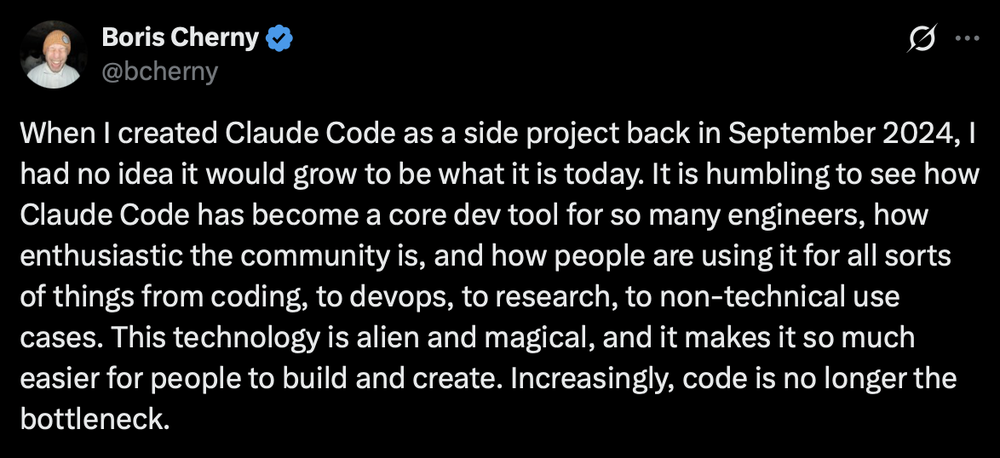

# Week 1: Overview & Setup - The Age of AI Agents

## Session Goals
- Understand what agent engineering is and why it matters
- See the landscape: Claude Code, Agent SDK, tools, skills, MCP
- Get fully set up with Claude Code and TypeScript environment
- Define a personal project idea for the series

---

## Block 1: Theory - What Are AI Agents? (30 min)

### The Shift from Chatbots to Agents

**Chatbot (2022-2023):**
- Human asks question → AI responds → Human acts
- AI is a consultant

**Agent (2024+):**
- Human defines goal → AI plans, acts, iterates → Human reviews outcome
- AI is a worker

### The Agent Loop

```
┌──────────────────────────────────────────────────────┐
│                                                      │
│   INPUT → THINK → SELECT TOOL → EXECUTE → OBSERVE    │
│              ↑                              │        │
│              └──────────────────────────────┘        │
│                    (repeat until done)               │
│                                                      │
└──────────────────────────────────────────────────────┘
```

### Core Concepts We'll Cover

| Week | Concept | What It Is |
|------|---------|------------|
| 2 | **Tool Calling** | How Claude executes actions (read files, run code, call APIs) |
| 3 | **MCP** | Universal protocol for connecting to external services |
| 4 | **Agent Skills** | Markdown files that teach Claude new capabilities |
| 5 | **Sub-agents** | Specialized agents that handle focused subtasks |
| 6 | **Agent SDK** | Run agents headlessly at scale (TypeScript) |
| 7 | **Evals** | Measure and improve agent quality systematically |

### Why Now?

- Models are good enough to reason reliably
- Tool use is mature and standardized
- Context windows are large enough for real work
- Cost has dropped 10-100x

### The Rise of GTM Engineering

A new role is emerging: **GTM Engineer**. These are technical people who build AI agents for sales, marketing, and revenue teams.

**Vercel's story:** They replaced 9 of 10 inbound SDRs with an AI agent in six weeks, using one part-time GTM engineer. Conversion rates stayed flat while speed improved.

> "For us, we had 10 SDRs doing this inbound workflow, and now we just have one that is effectively QAing the agent. The other nine, we deployed on outbound. It was six weeks before we felt confident going from 10 to 1."
> - Jeanne DeWitt Grosser, COO at Vercel

The job market reflects this shift. GTM engineering jobs grew 205% year-over-year in 2025. Vercel pays $202K-$302K for this role.

**Why this matters for you:** The skills you learn in this bootcamp are exactly what GTM engineers do. Data analysis, CRM automation, lead scoring, email workflows. You're learning to build the agents that are transforming go-to-market teams.

**References:**
- [Vercel GTM Engineer Job Posting](https://vercel.com/careers/gtm-engineer-us-5585464004)
- [Vercel's AI Sales Agent: 10 SDRs Down to 1](https://tomtunguz.com/vercel-ai-sales-agents-jeanne-grosser/)

### Claude Code: Beyond Coding

Even the creator of Claude Code is surprised by how people use it.



Boris Cherny, who created Claude Code as a side project in September 2024, notes that people are using it for "all sorts of things from coding, to devops, to research, to non-technical use cases."

The key insight: **"Increasingly, code is no longer the bottleneck."**

### The Future of Analytics

Here's where this is heading: **You won't manage dashboards. You'll ask for insights.**

Today, business users interact with BI tools. They build dashboards, write queries, maintain reports, refresh data. They manage the tools to get answers.

Tomorrow, they'll just ask questions. The agent handles the rest.

| Today | Tomorrow |
|-------|----------|
| "Let me check the dashboard" | "What's our conversion rate this week?" |
| "I need to pull a report" | "Show me deals at risk of slipping" |
| "Can someone query this?" | "Which customers should I call today?" |
| Managing tools | Asking questions |

Vercel's GTM team already works this way. They ask their agent to qualify leads. The agent searches their data, scores the lead, and drafts a response. No dashboard. No query. Just the answer.

This bootcamp teaches you to build that future. Not to replace BI tools, but to put an agent in front of them that understands what you actually need.

### Why Claude Code Over Alternatives?

You might wonder: why not LangChain, LangGraph, or CrewAI?

**The short answer:** Claude Code is arguably the best general-purpose agent harness available today.

It's not just another framework. It's a complete agent runtime built by Anthropic, the same team that builds Claude. That means it's designed around how Claude actually thinks and works, not bolted on as an afterthought.

**The insight:** LLMs are filesystem-native. They've seen grep, find, cat, and bash billions of times during training. These aren't new skills we teach them. They already know how to navigate directories, read files, and pipe commands.

Claude Code bets on this. Instead of building complex abstractions, it gives Claude a filesystem and bash. That's the core loop.

**Vercel validated this approach.** They rebuilt their text-to-SQL agent by stripping it down to one capability: execute bash commands in a sandboxed filesystem. The agent browses their data (YAML, Markdown, JSON files) using standard Unix tools, just like a human analyst would.

**Their results after removing 80% of their tools:**

| Metric | Before | After |
|--------|--------|-------|
| Success rate | 80% | 100% |
| Execution time | 275 seconds | 77 seconds (3.5x faster) |
| Token usage | Higher | 37% fewer tokens |
| Steps required | More | 42% fewer steps |

One query that failed after 724 seconds now succeeds in 141 seconds.

**The alternatives and their tradeoffs:**

| Framework | Approach | Problem |
|-----------|----------|---------|
| **LangChain** | Prompt chaining | Simple chains don't leverage what LLMs already know |
| **LangGraph** | Low-level DAG/graph control | Overkill. You're building plumbing, not solutions |
| **CrewAI** | Role-based agents with personas | Too many abstractions between you and the model |
| **Claude Code** | Filesystem + bash + tools | Works with how LLMs think, not against it |

**Why filesystems work:**

1. **Training distribution** - LLMs have seen Unix commands billions of times. grep, cat, find, awk. These aren't new skills we teach. They're native operations.
2. **Natural structure** - Customer data, CRM records, conversations already have hierarchy that maps to directories
3. **Precise retrieval** - Load only what you need, unlike vector search (imprecise) or prompt stuffing (token explosion)
4. **Debuggable** - You can see exactly which files the agent accessed and which commands it ran
5. **Minimal maintenance** - No custom retrieval pipelines per data type

**Real example: Sales call summarization**

Vercel built an agent to analyze sales calls. Instead of stuffing transcripts into prompts, they structured data as files:

```
/customers/cust_12345/
  ├── profile.json
  ├── tickets/
  │   ├── ticket_001.md
  │   └── ticket_002.md
  └── conversations/2024-01-15.txt
```

The agent uses bash to navigate: `ls` to explore, `grep` to find patterns like "pricing objection", `cat` to read specific files. It loads only what it needs, when it needs it.

**Results:** Cost dropped from $1.00 to $0.25 per call. Quality improved. Same model (Claude Opus).

The lesson from Vercel: "Addition by subtraction is real. The best agents might be the ones with the fewest tools."

**References:**
- [Vercel: How to Build Agents with Filesystems and Bash](https://vercel.com/blog/how-to-build-agents-with-filesystems-and-bash)
- [Vercel: We Removed 80% of Our Agent's Tools](https://vercel.com/blog/we-removed-80-percent-of-our-agents-tools)

### What If You Don't Like Terminals?

If the command line feels intimidating, Anthropic just launched **Claude Cowork**. Same agentic capabilities, but in a desktop GUI instead of a terminal.

Cowork runs in the Claude Desktop app (macOS). It can:
- Read and write files directly on your computer
- Create Excel spreadsheets, PowerPoints, and formatted documents
- Break complex tasks into parallel workstreams
- Handle long-running projects without timeouts

Think of it as Claude Code without the terminal. Same filesystem-native approach, friendlier interface.

This bootcamp uses Claude Code because it's more powerful for automation and integrations. But if you're non-technical and want to apply these concepts without learning the command line, Cowork is a valid path.

**Reference:**
- [Getting Started with Cowork](https://support.claude.com/en/articles/13345190-getting-started-with-cowork)

### Demo: Claude Code in Action

Live demo: Give Claude Code a multi-step task and watch it work.

Example: "Analyze this CSV, find the top 10 customers by revenue, and create a summary"

Watch how Claude:
1. Uses **tools** to read the file
2. Reasons about what to do
3. Executes code to analyze
4. Iterates until complete

---

## Block 2: Lab 1 - Environment Setup (30 min)

### Pre-Lab Checklist

Participants verify:
- [ ] Claude Pro subscription active
- [ ] Node.js 18+ installed (`node --version`)
- [ ] Git installed (`git --version`)
- [ ] VS Code or editor ready

### Model Requirements

This bootcamp requires **Claude Sonnet 4.5 or higher**.

Claude Code defaults to Sonnet, which is the right choice for most agent work. It balances capability with speed and cost. For complex reasoning tasks, you can switch to Opus.

| Model | Best For | Speed | Cost |
|-------|----------|-------|------|
| **Claude Sonnet 4.5** | Most agent work, coding, analysis (recommended) | Fast | $$ |
| **Claude Opus 4.5** | Complex reasoning, difficult problems | Slower | $$$$ |
| **Claude Haiku** | Simple tasks, sub-agents, high volume | Fastest | $ |

**To check your model in Claude Code:**

```
> /model
```

**To change models:**

```
> /model sonnet
> /model opus
```

For sub-agents doing research or data gathering, use Haiku to save cost. For writing, analysis, and complex reasoning, stick with Sonnet or Opus.

**Reference:** [Claude Models Overview](https://platform.claude.com/docs/en/about-claude/models/overview)

### Task 1: Install Claude Code (10 min)

```bash
# macOS/Linux
curl -fsSL https://claude.ai/install.sh | sh

# Or via npm
npm install -g @anthropic-ai/claude-code

# Verify
claude --version
```

### Task 2: Clone Workshop Repo (5 min)

```bash
git clone [REPO_URL_PROVIDED_BY_FACILITATOR]
cd workshop-claude-agents
```

### Task 3: Authenticate & Test (10 min)

```bash
# Start Claude Code in the repo
claude

# Test it's working
> What files are in this repository?
```

### Task 4: Explore the Repo Structure (5 min)

Ask Claude:
```
> Explain the structure of this repository and what each folder is for.
```

**Success criteria:** Claude correctly describes the repo structure using context from CLAUDE.md.

---

## BREAK (10 min)

---

## Block 3: Theory - The Claude Agent Stack (30 min)

### Layer 1: Tool Calling

Claude can use tools to take actions. Built-in tools include:

| Tool | What It Does |
|------|--------------|
| **Read** | Read files |
| **Write** | Create new files |
| **Edit** | Modify existing files |
| **Bash** | Run terminal commands |
| **Glob** | Find files by pattern |
| **Grep** | Search file contents |
| **WebSearch** | Search the web |
| **WebFetch** | Fetch web pages |

Week 2 dives deep into how tool calling works.

### Layer 2: MCP (Model Context Protocol)

MCP connects Claude to external services:

```bash
# Add a GitHub MCP server
claude mcp add --transport http github https://api.githubcopilot.com/mcp/

# Add a database server
claude mcp add --transport stdio db -- npx -y @bytebase/dbhub --dsn "postgresql://..."
```

Now Claude can query GitHub issues, read your database, etc.

Week 3 covers MCP in depth.

### Layer 3: Agent Skills

Skills are Markdown files that teach Claude new capabilities:

```
.claude/skills/
└── lead-scorer/
    ├── SKILL.md         # Instructions
    ├── references/      # Supporting docs
    └── scripts/         # Utility code
```

Claude automatically discovers and uses skills when relevant.

Week 4 covers creating effective skills.

### Layer 4: Sub-agents

The Task tool spawns specialized agents:

```typescript
// Main agent delegates to specialist
> "Use the code-reviewer agent to review this PR"

// code-reviewer runs with focused context
// Returns results to main agent
```

Week 5 covers sub-agent orchestration.

### Layer 5: Agent SDK

Run agents headlessly from TypeScript:

```typescript
import { query } from "@anthropic-ai/claude-agent-sdk";

for await (const message of query({
  prompt: "Process all leads in data/leads.csv",
  options: { allowedTools: ["Read", "Write", "Bash"] }
})) {
  console.log(message);
}
```

Week 6 covers SDK and fleet running.

### Claude Code CLI vs Agent SDK

A common question: what's the difference between running Claude Code as a CLI and using the Agent SDK?

**Claude Code CLI** is the complete product you interact with in the terminal:
- Full agent loop with built-in tools and permission management
- Runs as a standalone executable
- Great for interactive development work
- Can run in sandboxes (Daytona, Docker, etc.) for isolation

```bash
# Interactive mode
claude

# Headless mode (for automation)
claude --dangerously-skip-permissions -p 'your task' --output-format stream-json
```

**Claude Agent SDK** is a library you embed in your own application:
- Same agent loop and tools, but programmatic control
- Add custom tools as TypeScript/Python functions
- Full streaming, hooks, and session management
- Ideal for building products on top of Claude

```typescript
import { query } from "@anthropic-ai/claude-agent-sdk";

const result = await query({
  prompt: "Analyze the data",
  options: { maxTurns: 10 }
});
```

**Key Differences:**

| Aspect | Claude Code CLI | Claude Agent SDK |
|--------|-----------------|------------------|
| **What it is** | Complete CLI tool | Library for your app |
| **Control** | Shell commands, parse output | Full programmatic control |
| **Custom tools** | MCP servers only | In-process MCP servers via code |
| **Permissions** | `--dangerously-skip-permissions` | `permissionMode` + hooks |
| **Session state** | Managed externally | Built-in resumption |
| **Integration** | Subprocess | First-class SDK |

**When to use which:**
- **CLI in sandbox:** Running untrusted code, CI/CD pipelines, giving users isolated environments
- **SDK:** Building products, API servers, custom workflows, production automation

Both need sandboxing for production. The SDK does not provide isolation by itself.

### The Full Stack

```
┌─────────────────────────────────────────┐
│           Your Application              │
├─────────────────────────────────────────┤
│         Claude Agent SDK (TS)           │  ← Week 6
├─────────────────────────────────────────┤
│    Sub-agents    │    Agent Skills      │  ← Week 5, 4
├─────────────────────────────────────────┤
│              MCP Servers                │  ← Week 3
├─────────────────────────────────────────┤
│             Tool Calling                │  ← Week 2
├─────────────────────────────────────────┤
│               Claude                    │
└─────────────────────────────────────────┘
```

---

## Block 4: Lab 2 - First Steps with Claude Code (45 min)

### Task 1: Customize Your CLAUDE.md (15 min)

Open `CLAUDE.md` in the repo. Currently it's generic.

**Your task:** Modify it to describe your project context.

Example additions:
```markdown
## My Project Context

I'm building agents for [data analytics / GTM / other].

My focus area: [describe your use case]

Key metrics I care about: [list them]
```

Test it:
```
> Based on my project context, what kind of agent would be most useful?
```

### Task 2: Explore Built-in Tools (15 min)

Try these commands in Claude Code:

```
> What files are in the data folder?

> Read the startup-funding.db and summarize what's in it

> Search for any files that mention "revenue" or "customer"

> Find all markdown files in this repo
```

Notice which tools Claude uses for each task (Glob, Read, Grep).

### Task 3: Data Exploration Preview (15 min)

**About the dataset:** This repo includes `startup-funding.db`, a SQLite database modeled on real venture capital activity from 2018-2025. It has 200 startups (including AI coding tools like Cursor and Replit), 66 investors, and ~480 funding rounds across industries. We'll use this dataset throughout the workshop to practice data analysis with Claude.

```
> Look at data/startup-funding.db. Tell me:
> 1. How many rows and columns
> 2. What the columns represent
> 3. Any obvious data quality issues
> 4. Which leads look most promising and why
```

This previews the data analytics use case we'll build on.

---

## Wrap-Up (15 min)

### The 8-Week Journey

| Week | What You'll Learn | What You'll Build |
|------|-------------------|-------------------|
| 1 | Setup and basics | ✓ Environment ready, project defined |
| 2 | Tool calling | Research workflows using web + file tools |
| 3 | MCP integrations | Connections to your databases and services |
| 4 | Agent Skills | Custom skills encoding your domain expertise |
| 5 | Sub-agents | Multi-stage pipeline for your workflow |
| 6 | Agent SDK | Headless batch processor in TypeScript |
| 7 | Evals | Test suite to validate your agent's behavior |
| 8 | Demo day | Present your project to the group |

### Homework: Define Your Project

**Due before Week 2:**

Write a 1-paragraph description of an agent you want to build.

**Requirements:**
- Must involve a repeatable workflow you want to automate
- Must be something useful to you (real or realistic)
- Must be achievable in 7 weeks of incremental building

**Examples by Domain:**

| Domain | Example Project |
|--------|-----------------|
| GTM/Sales | Research companies, score leads, and draft personalized outreach emails |
| Data Analytics | Profile datasets, identify anomalies, generate weekly quality reports |
| Developer Tools | Review PRs, generate documentation, track technical debt |
| Content/Marketing | Research topics, draft blog posts, repurpose content across channels |
| Customer Support | Categorize tickets, draft responses, escalate complex issues |
| Operations | Process invoices, reconcile data, generate compliance reports |

Pick something from your actual work. The course uses GTM examples, but the patterns apply to any domain.

**Submit:** Share with the facilitator before Week 2.

### Resources

- [Claude Code Documentation](https://code.claude.com/docs)
- [Claude Models Overview](https://platform.claude.com/docs/en/about-claude/models/overview)
- [Agent SDK Documentation](https://platform.claude.com/docs/en/agent-sdk/overview)
- [Agent Skills Specification](https://agentskills.io/specification)
- [MCP Protocol](https://modelcontextprotocol.io)

### Next Week Preview

Week 2: Tool Calling
- How Claude decides which tools to use
- Tool schemas and input validation
- Building custom tools
- Lab: Data analysis tools

---

## Facilitator Notes

### Common Setup Issues

1. **Claude not authenticated:** Run `claude` and follow prompts
2. **Node version too old:** Use nvm to install Node 18+
3. **npm permissions:** Avoid sudo, fix npm permissions
4. **Windows users:** Recommend WSL2

### Timing Adjustments

If setup takes longer than expected:
- Lab 2 Task 3 can be shortened or made homework
- Focus on getting everyone to successful "What files are in this repo?" test

### Engagement Tips

- Ask participants to share their project ideas in chat during wrap-up
- Create breakout rooms for troubleshooting during setup
- Have TA/co-facilitator monitor chat for stuck participants
